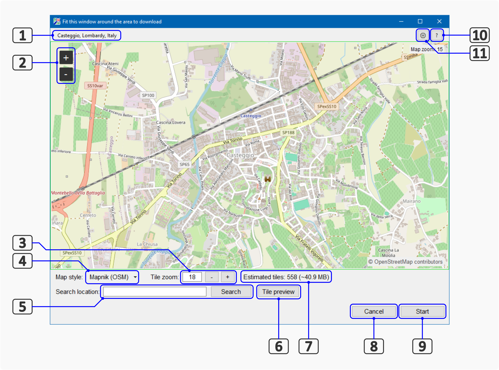
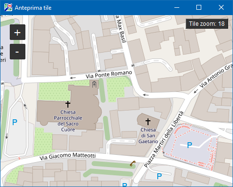
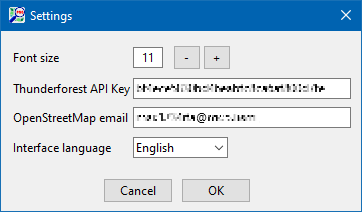
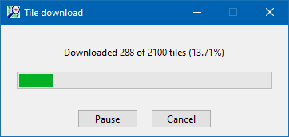

# OSM to PNG

## **Index**

>[Introduction](#introduction)
>
>[Graphical interface](#graphical-user-interface)
>
> [Selecting the area to download](#selecting-the-area-to-download)
>
> [Download settings](#download-tile-settings)
>
> [Other program settings](#other-program-settings)
>
> [Downloading tiles](#downloading-the-tiles)
>
> [Translating the user interface into a different language](#translating-the-user-interface-into-a-different-language)
>
> [Translating the Help file into a different language](#translating-the-help-file-into-a-different-language)
>
 
 

---

## Introduction
This program allows to merge multiple OpenStreetMap (OSM) tiles into a single large image, covering a chosen area at the desired zoom level.

The development started from a script available from <a href="https://bikingaroundagain.com/make-paper-maps-osm-data" target="_blank">*Biking Around Again*</a>, along with other small utilities.

The code, originally for Python 2, has been adapted to work in Python 3.12; a graphical interface has also been added, allowing to select the bounding box (*“bbox”*) set the downloaded tile zoom factor more intuitively.

[ ^^ Go to Index](#index) 

---
## Graphical User Interface

On startup, an interactive OpenStreetMap map is displayed.
You can move the view by dragging it with the mouse; to change the zoom, move the mouse wheel or use the **“ + ”** and **“ - ”** buttons on the left. 

**Main elements of the window**:

>**1.** Location closest to the center of the map (city, town or village)
>
>**2.** Displayed map zoom
>
>**3.** Zoom level of the downloaded tiles
>
>**4.** Map style selection
>
>**5.** Location search (via *Nominatim*)
>
>**6.** Preview tiles at the desired zoom level [ 3 ]
>
>**7.** Estimated number of tiles required to cover the area, and their total weight (approximate)
>
>**8.** Exit program
>
>**9.** Start download
>
>**10.** Help (view this document)
>
>**11.** Settings

[ ^^ Go to Index](#index) 

---
## Selecting the area to download
 - Center the window on the desired location. If you wish, you can search for the desired using the *Nominatim* service **[ 5 ]** : type the name (i.e.: *Milan*) in the *Search Location* text box and click the *Search* button.

 - Resize the window by dragging its edges and/or adjust the displayed map zoom using the ‘+’ and ‘-’ buttons **[ 3 ]** in the upper left corner, so that the entire area desired area is displayed;

>  **IMPORTANT** - *<u>The window edge defines the bbox</u>; The map zoom does NOT affect the zoom factor of the downloaded; which must be set manually.*

[ ^^ Go to Index](#index) 

---

## Download settings
 -  Select the desired map style from the dropdown list **[ 4 ]**.

>    **ATTENTION** - *The “Mapnik (OSM)” style is provided by [OpenStreetMap](https://www.openstreetmap.org): an email address must be specified in order to download the tiles; all other styles are provided by [Thunderforest](https://www.thunderforest.com); to view and download them, an “API Key” is required, which can be obtained by creating an account on [https://www.thunderforest.com](https://www.thunderforest.com) website;   
Email and/or API Key must be entered in the respective fields, in the Settings menu* **[ 11 ]** 

- Use the *Zoom tile* control  **[ 3 ]** to set the desired zoom factor for the downloaded tiles. N.B.: this control will NOT change the zoom of the map displayed in the window); on the right  **[ 7 ]**, the number of tiles needed to cover the selected area and an approximate estimate of their total weight in Megabytes are shown.

 - Click on the *Tile preview* button  **[ 6 ]** to display a pop-up window, useful to check the level of detail actually set for the download. 

[ ^^ Go to Index](#index) 

---

## Other program settings
Click the [⚙️] button in the upper-right corner of the window, to display the *Settings* menu:

- **Font size** used in the program window;

 - **API Key**: key needed enable the tile download for the styles provided by thunderforest.com (Cyclemap, Transport, etc.).  
To obtain an API Key, just visit *https://www.thunderforest.com*, register a new account (you must provide a valid email address), and/or log in. 
The free plan offered by Thunderforest.com allows downloading up to 150,000 tiles per month, which should be more than enough for non-intensive use of the service: for example, to cover the entire area of Milan (Italy) at zoom level 17 (where all the street names are visible), about 11,000 tiles are needed (about 7% of the entire quota);

 - **OpenStreetMap email**: this is required to enable the download the Mapnik style tiles, native to the OpenStreetMap project. You can enter any email address, but recommendation is to use an OSM account (you can subscribe for free at *https://www.openstreetmap.org* ).    

> **ATTENTION:** <u>*OpenstreetMap does not set any limits</u> on the number of tiles that can be downloaded, but they recommend “not to send an excessive number of requests” (a quite generic concept too): for intensive use, it would be more advisable to use a local tile server. 
>By design, the program uses the OSM server, but sends requests at a slow rate in order not to overload it.*

- **Interface language**: Select the desired language from those available in the dropdown list. Close and restart the app to apply this setting.

[ ^^ Go to Index](#index) 

---

## Downloading the tiles

- Click the “Start” button **[ 9 ]** to begin downloading the images for the selected area, at the desired style and zoom factor. 

 - A Resource Manager window is displayed (*"Save as"*);  
  Select the destination directory, type in the file name (extension must be *.png*) and click on the *Save* button to start the download.

 

 - A small monitoring window will then appear: wait for the operation to complete; if you wish, you can temporarily pause the download (*[Pause]* button) or abort it (*[Cancel]*).

 

> **WARNING** - *Tile downloading relies on online services and may take a long time. The OpenStreetMap and ThunderForest servers are not designed to handle massive operations: the program tries to interact with them respectfully and sends its requests at a quite slow rate, with frequent pauses.*

[ ^^ Go to Index](#index) 

---
___

## Translating the user interface into a different language

The language of the user interface is defined by *.ini* files located in the */lang* directory; the file name is in the format “ui_[language].ini”, such as *ui_English.ini* for English and *ui_Italiano.ini* for Italian.

1. Using a File Manager, such as Windows File Manager, **go to the folder where the main program is located** (*osm2png*) and enter the */lang* directory.

2. **Create a copy** of the source language file and rename it, replacing the language name with the desired one.

> **Example**: for a French translation, copy the file *ui_english.ini* (English language) and rename it *ui_français.ini*.

3. **Open the new file in any ASCII text editor**, such as *Notepad* in Windows or *Gedit* in Linux, and translate all the strings into the new language.  
>Just **keep in mind 2 points**:    
> - **“Key” names** (--> whatever is to the left of the “=” sign) **must not be changed**.   
> - **The values in curly brackets**, i.e. '*{n_tiles}*', **must not be changed**.
>
>
> **Example**: 
>
>
> *zoom_map_label = Map zoom* will become
>
> *zoom_map_label = Zoom de la carte*

 

> **IMPORTANT: *the [info] section must be filled in as follows***:
>
>
>
> **[info]**  
>
> **language** = Name of the language to be displayed in the menu (e.g. *‘Français’*)  
>
> **lang** = international language code (i.e. ‘*fr*’)  
>
> **translator** = Name of the translator (optional)  
>
> **help_file** = name of the help file to be displayed when the ‘ ? ’ button is clicked **[ 10 ]** (see below)
>
>

4. **Save** the file and restart the program: the new language should be available in the **⚙️** *Settings* menu.

[ ^^ Go to Index](#index) 

---

## Translating the help file into a different language

The user help files are text documents written in [Markdown format](https://it.wikipedia.org/wiki/Markdown) and located in the */lang* directory: they can be edited with any text editor such as Windows Notepad, but using an application that can also preview the result is recommended, such as Visual Studio Code (*https://code.visualstudio.com/download*) or Ghostwriter (*https://github.com/KDE/ghostwriter*).

 

If you want to translate the help file into another language:

1. Using a File Manager, **go to the folder where the main program is located** (*osm2png*) and enter the */help* directory.

2. **Create a copy** of the file corresponding to the source language and rename it, replacing the language code with the desired one.

> **Example**: for a French translation, copy the file *help_eng.md* (English language) and rename it *help_fra.md*. 

3. Open the new file in the Markdown editor and **perform the translation**.   

It does not need to be literal, but it would be good to respect the structure and layout of the source document, as well as the basic rules of the Markdown language.

4. **Save** your work and **update the [info] section** of the *.ini* file that configures the program interface in the same language (/lang/ui_[Language].ini), as explained in point ‘3’ of the previous paragraph (see).*  

> **Example**: if the name of the new file is *help_fra.md*, in the [info] section of */lang/ui_Français.ini* you must specify the key:      

>

>&emsp; *help_file = help_fra.md*

> ### **IMPORTANT**:  

>*The .md file must be located into the "/help" folder; If the "help_file" key [info] section, in the user interface .ini file, doesn't the help file name, then the new translation will not be available in the program.*

[ ^^ Go to Index](#index) 